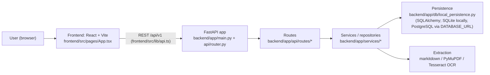
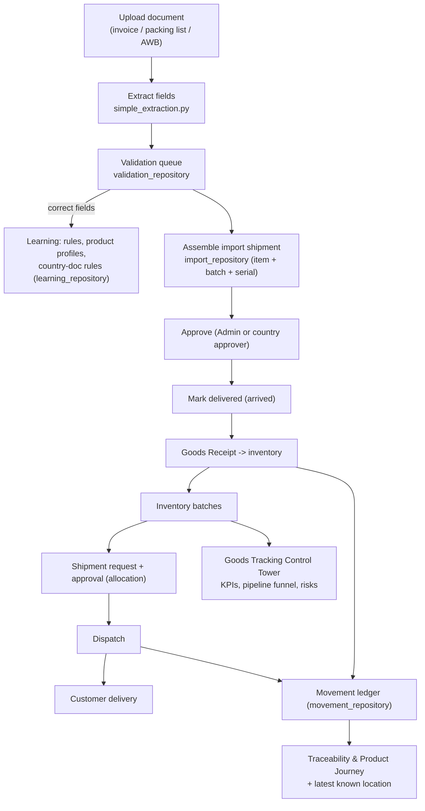

# Architecture Map — Supply Chain Control Tower

A document-driven warehouse, import, inventory, shipment, ERP, dashboard, and RBAC
platform for a healthcare / medical-device company.

This map is generated and maintained by hand (no unverified third-party code-graph
tools). For an automated dependency graph you can additionally run the verified
tools noted at the end.

## High-level architecture



## Goods lifecycle & data flow



## Backend module map (`backend/app`)

| Route (`api/routes`) | Service (`services`) | Purpose |
| --- | --- | --- |
| `documents` | `local_document_store`, `simple_extraction` | Upload + scan/extract documents |
| `validation` | `validation_repository` | Field validation queue + corrections |
| `imports` | `import_repository` | Assemble shipment, approve, mark delivered, post goods receipt |
| `goods_receipts`, `inventory`, `inventory_counts` | `warehouse_repository` | Receipts, stock, cycle counts |
| `shipments`, `dispatches` | `warehouse_repository` | Outbound requests, approvals, dispatch |
| `movements` | `movement_repository` | Movement ledger, batch traceability, product journey, location events |
| `learning` | `learning_repository` | Corrections, rules, product profiles, country-doc rules, insights, import checklist, correction suggestions |
| `security` | `security_repository` | Users, roles, approval rules, login, RBAC (country scope, admin) |
| `erp_uploads` | `erp_repository` | ERP upload preview/export |
| `masters`, `products`, `customers`, `warehouses` | repositories above | Master data |
| `dashboard`, `expiry`, `audit`, `assistant` | repositories above | Read models / overview |

Cross-cutting:
- **Extraction** (`simple_extraction.py`): markitdown for invoice lines (best-of-both), PyMuPDF for text, Tesseract OCR for scanned AWBs; parsers in `import_repository` (date-anchored, serial-aware).
- **Persistence** (`db/local_persistence.py`): SQLAlchemy; `DATABASE_URL` selects SQLite (local) or PostgreSQL (prod).
- **Audit**: every write records an audit event.

## Frontend view map (`frontend/src/pages/App.tsx`, nav order)

`Dashboard` · `Goods Tracking` (control tower) · `Traceability` (batch/product journey, location capture) · `Progress` · `Documents` · `Import Validation` (approve → mark delivered → goods receipt, stage tracker) · `ERP Upload` · `Products` · `Inventory` · `Shipments` · `Dispatches` · `Receipts` · `Counts` · `Expiry` · `Customers` · `Security` · `Audit` · `Learning` (insights) · `Assistant`.

Shared: `frontend/src/lib/api.ts` (typed API client), `frontend/src/styles.css` (theme tokens `--tower-*`, light/dark via `data-theme`, motion layer).

## Optional: automated dependency graphs (verified tools)

```powershell
# Frontend module graph
npx madge --image frontend-graph.svg frontend/src/pages/App.tsx
# Backend module graph (needs Graphviz installed)
pip install pydeps; pydeps backend/app --max-bdepth 2 -o backend-graph.svg
```
