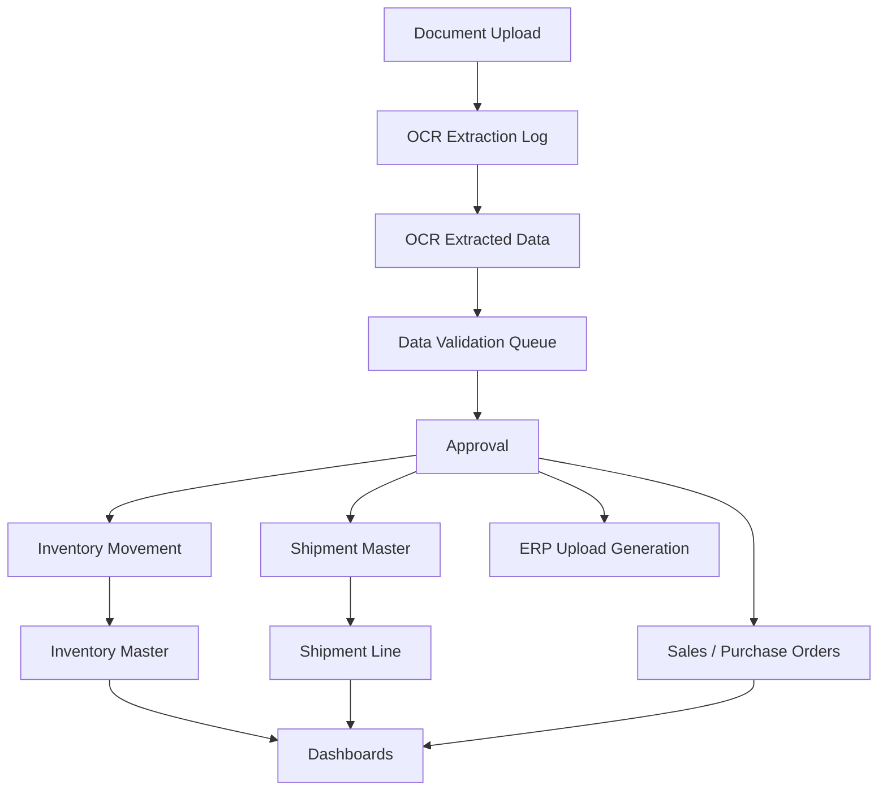

# Supply Chain Control Tower Architecture

## Business Goal

Build a document-driven supply chain control tower for a medical device company, with strong traceability, inventory controls, shipment tracking, forecasting, ERP output generation, and role-based access.

## Core Workflow

## Main Domains

- Master Data: business units, countries, currencies, entities, warehouses, products, customers, suppliers, carriers, users, roles, document types, statuses, movement types.
- Documents: uploaded source files, OCR logs, extracted fields, template mappings.
- Validation: field-level review, approval, rejection, correction, and auditability.
- Inventory: stock balances, movements, batch tracking, serial tracking, expiry tracking, status controls.
- Shipments: shipment header, shipment lines, carriers, statuses, shipment references.
- Orders: sales orders, purchase orders, forecast uploads.
- Analytics: operational dashboards and exception reporting.
- ERP Outputs: configurable Excel templates and generated upload files.

## Backend Layers

- API routers expose versioned endpoints.
- Schemas define request and response contracts.
- Models define persisted database entities.
- Services hold business workflows.
- Workers handle OCR and document processing jobs.
- Core contains configuration, auth, RBAC, and audit helpers.

## Initial Delivery Principle

Start with a human-in-the-loop validation system before automating transaction creation deeply. This keeps the platform useful early while protecting data quality in regulated medical-device supply chain processes.

