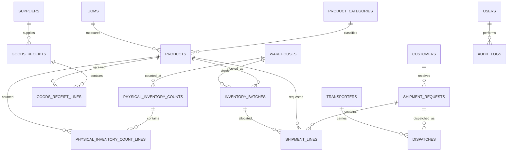

# Module Relationships

## Key Relationship Rules

- Product cannot be deleted if inventory batches exist.
- Shipment line must reference a valid inventory batch.
- Dispatch must reference an approved shipment.
- Dispatch reduces inventory.
- Goods receipt increases inventory.
- Physical count reconciliation creates adjustment movements.
- Audit logs should capture create, update, approve, dispatch, receipt, and reconciliation events.

