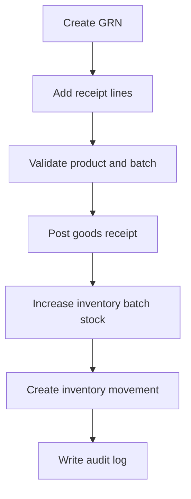
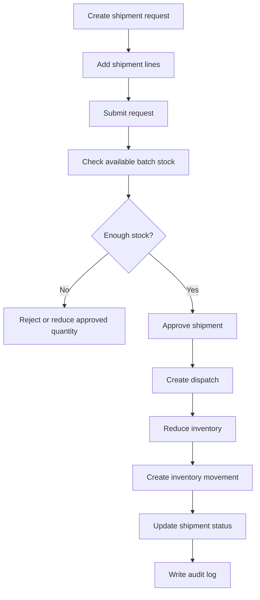
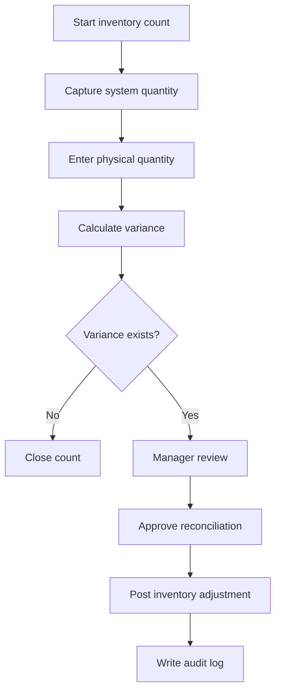
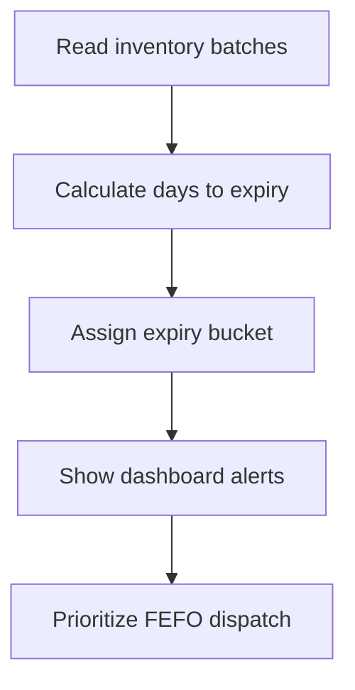

# Workflow Diagrams

## Goods Receipt Workflow

```mermaid
flowchart TD
    A["Create GRN"] --> B["Add receipt lines"]
    B --> C["Validate product and batch"]
    C --> D["Post goods receipt"]
    D --> E["Increase inventory batch stock"]
    E --> F["Create inventory movement"]
    F --> G["Write audit log"]
```

## Shipment Approval and Dispatch Workflow

```mermaid
flowchart TD
    A["Create shipment request"] --> B["Add shipment lines"]
    B --> C["Submit request"]
    C --> D["Check available batch stock"]
    D --> E{"Enough stock?"}
    E -- "No" --> F["Reject or reduce approved quantity"]
    E -- "Yes" --> G["Approve shipment"]
    G --> H["Create dispatch"]
    H --> I["Reduce inventory"]
    I --> J["Create inventory movement"]
    J --> K["Update shipment status"]
    K --> L["Write audit log"]
```

## Physical Inventory Count Workflow

```mermaid
flowchart TD
    A["Start inventory count"] --> B["Capture system quantity"]
    B --> C["Enter physical quantity"]
    C --> D["Calculate variance"]
    D --> E{"Variance exists?"}
    E -- "No" --> F["Close count"]
    E -- "Yes" --> G["Manager review"]
    G --> H["Approve reconciliation"]
    H --> I["Post inventory adjustment"]
    I --> J["Write audit log"]
```

## Expiry Management Workflow

```mermaid
flowchart TD
    A["Read inventory batches"] --> B["Calculate days to expiry"]
    B --> C["Assign expiry bucket"]
    C --> D["Show dashboard alerts"]
    D --> E["Prioritize FEFO dispatch"]
```

